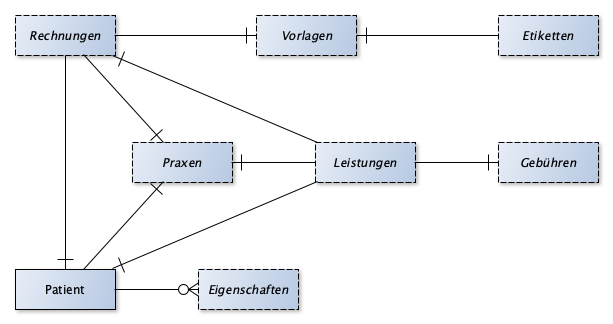

# Naturheilpraxis

Als Heilpraktiker möchte ich die Leistungen für Patienten erfassen, um ihnen
diese in Rechnung zustellen.

## Verwalte Patienten

- [x] *Nimm Patient auf*
- [ ] Lese Patientenkarteikarte
- [ ] Aktualisiere Patientenkarteikarte
- [x] *Lese Patientenkartei*

## Erbringe Leistungen

- [ ] *Erbringe Leistung*
- [ ] Lese Leistungsbeschreibung
- [ ] Aktualisiere Leistungsbeschreibung
- [ ] *Lese Leistungen für Patient*
- [ ] Lösche Leistung
- [ ] Aktualisiere GebüH
- [ ] Lese GebüH

## Schreibe Rechnungen

- [ ] *Erstelle Rechnung*
- [ ] Lese Rechnung
- [ ] Aktualisiere Rechnung
- [ ] Fakturiere Rechnung
- [ ] Lese Rechnungen
- [ ] Storniere Rechnung

## ER-Diagramm

